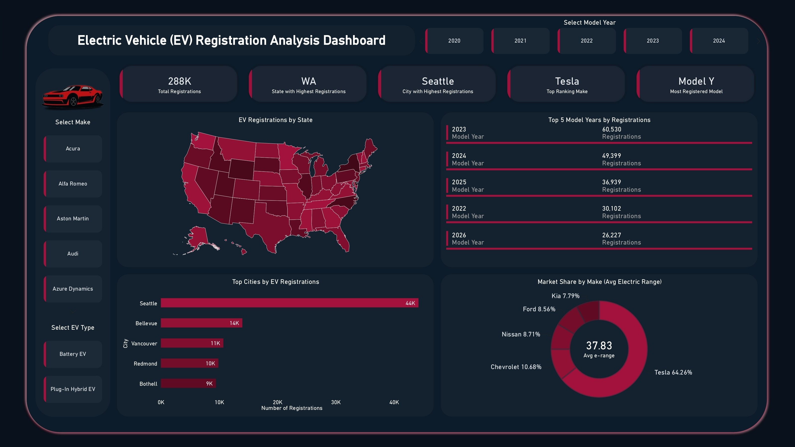

# ⚡ Electric Vehicle (EV) Population Analysis

An end-to-end data analytics project covering **data cleaning, exploration, and business analysis in PostgreSQL**, culminating in an interactive **EV Registration Analysis Dashboard**.



---

## 📌 Project Overview

Electric vehicle adoption is reshaping the automotive industry, and government registration data offers a powerful lens into where and how that shift is happening. This project takes a raw, messy EV title and registration dataset from [data.gov](https://catalog.data.gov/dataset/electric-vehicle-title-and-registration-activity) and transforms it into a clean, analysis-ready dataset — then answers real business questions and visualizes the results in an interactive dashboard.

The goal was to simulate a real-world analytics workflow: **ingest → clean → validate → analyze → visualize**, entirely in SQL, followed by dashboarding.

---

## 🗂️ Dataset

- **Source:** [U.S. Electric Vehicle Title and Registration Activity — data.gov](https://catalog.data.gov/dataset/electric-vehicle-title-and-registration-activity)
- **Raw table:** `ev_population`
- **Cleaned output table:** `ev_data`
- **Fields:** City, State, Model Year, Make, Model, EV Type, Electric Range, Vehicle Location (Longitude/Latitude)

---

## 🛠️ Tech Stack

| Layer | Tool |
|---|---|
| Database | PostgreSQL |
| Data Cleaning & Analysis | SQL (CTEs, Window Functions, Aggregations) |
| Visualization | Interactive BI Dashboard |
| Version Control | Git & GitHub |

---

## 🧹 Data Cleaning Process

All cleaning logic lives in [`ev_population.sql`](analysis_files/ev_population.sql) and follows a structured, documented pipeline:

1. **Initial Inspection** — Row counts and raw data preview.
2. **Exploration** — Model year range, distinct manufacturers.
3. **Cleaning**
   - Standardized text casing (`INITCAP`, `TRIM`) for city, state, make, and model.
   - Parsed `longitude` / `latitude` out of the raw `POINT (...)` geometry string.
   - Normalized EV type labels (e.g., `"Battery Electric Vehicle (BEV)"` → `Battery EV`).
4. **Data Quality Checks** — Flagged rows with null values across all key fields.
5. **Missing Value Handling**
   - Dropped rows with unrecoverable missing `city` values.
   - Imputed missing `electric_range`, `longitude`, and `latitude` using column averages to preserve dataset size without distorting distributions.
6. **Final Dataset Creation** — Rebuilt a clean, sequential primary key using `ROW_NUMBER()`.
7. **Validation** — Confirmed zero remaining nulls and verified final row counts.

📋 **Design decisions documented in-line:** duplicate registrations were intentionally retained (they represent distinct, valid vehicle records — not errors), and every cleaning choice is explained directly in the SQL comments for full transparency.

---

## ❓ Business Questions Answered

| # | Question |
|---|---|
| 1 | Which cities have the most EV registrations? |
| 2 | Which vehicle brands are the most popular? |
| 3 | What are the top 10 most registered EV models? |
| 4 | What's the split between Battery EVs (BEV) and Plug-In Hybrid EVs (PHEV)? |
| 5 | Which model years have the highest number of registrations? |
| 6 | Which brands offer the highest average electric driving range? |
| 7 | Which cities have the highest average electric range? |
| 8 | What percentage of all registered EVs belong to the top 5 manufacturers? |

Each question is answered with a dedicated, ranked, and percentage-weighted SQL query using `DENSE_RANK()`, `GROUP BY`, and subquery aggregation.

---

## 📊 Dashboard Highlights

The final dataset powers an interactive dashboard with dynamic **Model Year**, **Make**, and **EV Type** filters:

- **288K** total EV registrations analyzed
- **Washington (WA)** — state with the highest registrations
- **Seattle** — city with the highest registrations (44K+)
- **Tesla** — top-ranking make, commanding **64%+ market share**
- **Model Y** — most registered EV model
- Full U.S. choropleth map of registrations by state
- Top 5 model years by registration volume
- Top cities breakdown (Seattle, Bellevue, Vancouver, Redmond, Bothell)
- Market share & average electric range by manufacturer

---

## 📁 Repository Structure

```
├── analysis_files/            # SQL cleaning + business-question queries
│   └── ev_population.sql
├── dashboard_files/           # Dashboard source/export files
│   └── ev_population.jpg          
├── dataset_files/             # Raw & Cleaned dataset (data.gov source)
├── images_files/              # Dashboard Image files used 
└── ReadMe.md
```

---

## 👤 Author

**Hrithik Ram**
📊 Data Analyst | SQL • PostgreSQL • Data Visualization
🔗 Connect with me on [LinkedIn](https://www.linkedin.com/in/hriithikram/)

---

## 📄 License

This project uses public data from [data.gov](https://catalog.data.gov/dataset/electric-vehicle-title-and-registration-activity) and is intended for educational and portfolio purposes.
